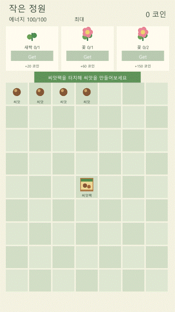

# Merge Board MVP

[웹에서 플레이하기](https://altjd67.github.io/merge-game/)

Unity uGUI로 만든 7 × 9 머지 보드 MVP입니다. 아이템을 생성하고 같은 단계끼리 합성해 주문을 완료하면 코인을 획득합니다. 작은 게임 루프 안에서 상태 모델링, UI 입력 분리, 로컬 저장·복원, 검증 자동화를 구현하는 데 집중했습니다.



## 핵심 기능

- 63칸 보드에서 아이템 드래그 이동 및 3단계 합성
- 생성기 클릭으로 가장 가까운 빈 칸에 씨앗 생성, 에너지 1 소모
- 주문 3개 제출, 보상 지급, 방금 완료한 주문을 제외한 무작위 주문 교체
- 120초마다 에너지 1 회복(최대 100), 종료 중 경과 시간도 반영
- 보드·코인·주문·에너지 상태를 PlayerPrefs의 JSON으로 저장하고 다음 실행 시 복원
- 잘못된 드롭, 가득 찬 보드, 에너지 부족에 대한 안전한 처리와 피드백

## 실행

1. Unity Hub에서 이 저장소를 **Unity 6000.3.21f1**로 엽니다.
2. 패키지 임포트와 컴파일이 완료될 때까지 기다립니다.
3. [MergeBoard.unity](Assets/MergeBoard/Scenes/MergeBoard.unity)를 열고 Play를 실행합니다.

Windows에서 검증했습니다. Game View는 1080 × 1920 또는 동일한 세로 비율을 권장합니다.

## 플레이 방법

| 행동 | 결과 |
| --- | --- |
| 씨앗 팩 클릭 | 가장 가까운 빈 칸에 씨앗 생성, 에너지 1 소모 |
| 아이템을 빈 칸으로 드래그 | 아이템 이동 |
| 같은 단계의 아이템 두 개를 겹치기 | 다음 단계 아이템으로 합성 |
| 활성화된 주문의 `Get` 클릭 | 필요 아이템 소비, 코인 보상, 새 주문 표시 |

## 설계

```text
View (입력·표시)
        ↓
MergeGameController (이동·합성·생성·주문·보상 규칙)
        ↓
Model (보드·아이템·주문·코인·에너지 상태)
        ↓
LocalSaveService (PlayerPrefs JSON 저장·복원)
```

View는 uGUI 입력과 표시만 담당하고, 게임 규칙은 `MergeGameController`, Unity 의존 없는 상태는 Model에 둬 테스트와 변경 범위를 분리했습니다. 저장은 생성, 이동/합성, 주문 완료, 에너지 보정 직후 수행하며, 저장 데이터가 없거나 유효하지 않으면 기본 상태로 안전하게 시작합니다.

주요 코드:

- [MergeGameController.cs](Assets/MergeBoard/Scripts/MergeGameController.cs) — 핵심 게임 규칙과 상태 저장 시점
- [MergeGameBootstrap.cs](Assets/MergeBoard/Scripts/MergeGameBootstrap.cs) — 씬 초기화와 View 연결
- [Model](Assets/MergeBoard/Scripts/Model) — 보드, 아이템, 주문, 저장 데이터
- [LocalSaveService.cs](Assets/MergeBoard/Scripts/LocalSaveService.cs) — PlayerPrefs JSON 저장·복원 및 데이터 검증

## 검증

2026-09-06 기준 Unity 6000.3.21f1 / Windows에서 다음을 확인했습니다.

- Unity Editor Console: Error 0, Warning 0
- 7 × 9 경계, 드래그 이동, 합성 성공·실패 규칙
- 생성 위치, 에너지 소모·회복·오프라인 보정, 주문 보상·교체
- 저장 데이터 손상 시 기본 상태 복구와 재실행 복원
- Editor Play Mode 전체 루프 및 Windows Development Build

재검증에는 저장소에 포함된 `unity-cli` 연결을 사용합니다.

```powershell
unity-cli editor refresh --compile
unity-cli console --filter all --stacktrace short
unity-cli exec 'MergeBoard.Editor.MergeBoardVerification.VerifyRules(); return true;'
unity-cli exec 'MergeBoard.Editor.SaveVerification.VerifySave(); return true;'
```

## 범위

기획과 완료 조건은 [MVP_SPEC.md](MVP_SPEC.md), 설계 상세는 [설계 문서](docs/design/merge-board-mvp-design.md)를 기준으로 합니다. 서버·로그인·결제·광고·상점·튜토리얼·추가 아이템/주문 확장은 의도적으로 제외했습니다.
